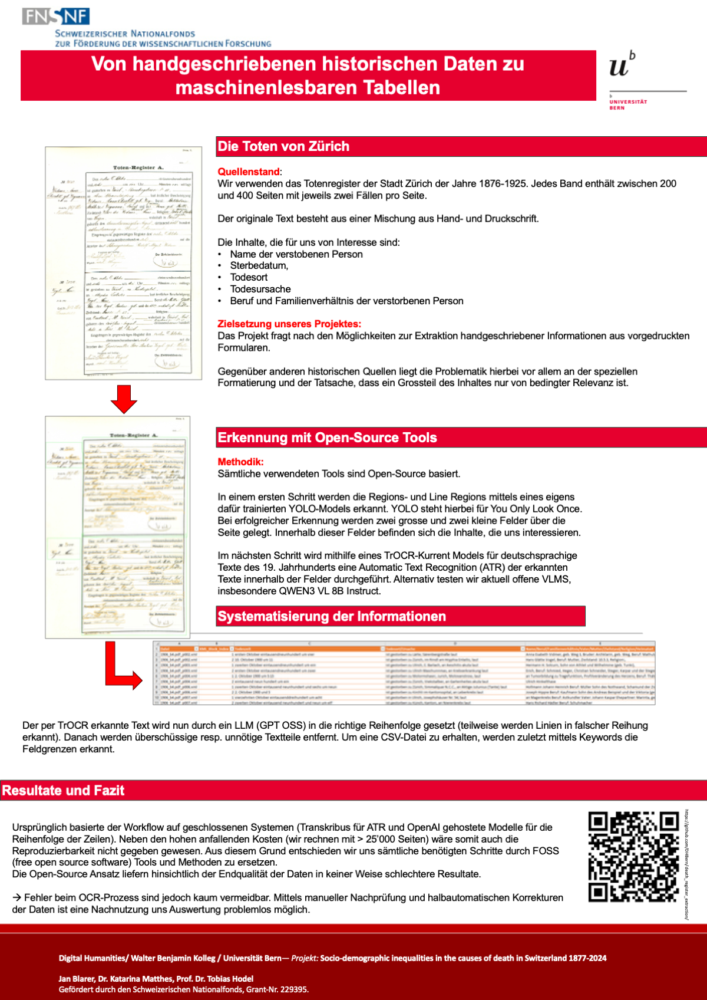

We are sharing previews of our posters prepared for the DHD 2026 conference. Click any preview to open the full-resolution file.

## Poster paper summaries

### Informationsextraktion serieller Quellen

Das Poster zeigt, wie serielle Quellen wie Zürcher Sterberegister in strukturierte, auswertbare Daten überführt werden können. Der Workflow kombiniert Layout- und Zeilensegmentierung mit ATR (u. a. Transkribus, YOLO, TrOCR) und LLM-gestütztem Post-Processing, um tabellarische Daten ohne manuelle Korrektur zu erzeugen. Erste Ergebnisse deuten auf eine hohe Automatisierbarkeit hin, während Kosten und Skalierbarkeit den Einsatz offener Werkzeuge motivieren. Als Ausblick werden vLLM-gestützte LLM-Implementationen sowie eine offene Publikation des Workflows genannt.

### Nicht nur Namen und Orte: Warum historische Annotation mehr kann (und soll)

Das Poster argumentiert für reichhaltigere Annotationen in den Geschichtswissenschaften, die über minimale Registerzwecke hinausgehen. Vorgestellt wird das verschachtelte BeNASch-Schema, das Referenzen, beschreibende Elemente und Werte systematisch erfasst und dadurch Beziehungen und Ereignisse ableitbar macht. Mit INCEpTION, Vorannotationen und Post-Processing-Skripten wird der Mehraufwand reduziert. Anwendungsbeispiele aus Ökonomien des Raums und The Flow zeigen, wie solche Annotationen neue Auswertungen ermöglichen und zugleich die Interoperabilität sowie das Training von KI-Modellen verbessern.

## Poster previews

::: {.poster-grid}
::: {.poster-card}
### Informationsextraktion serieller Quellen

[{fig-alt="Preview image of the DHD 2026 Wien Sterbedaten poster"}](Poster_Wien_Sterbedaten.png)
:::

::: {.poster-card}
### Nicht nur Namen und Orte: Warum historische Annotation mehr kann (und soll)

[{fig-alt="Preview image of the BeNASch DHD 2026 poster"}](benasch_poster_dhd.jpg)
:::
:::

::: {.callout-note collapse="true" title="Full poster paper (expand)"}
**Informationsextraktion serieller Quellen.**

[Open full paper (full screen)](paper-informationsextraktion.html)

**Blarer, Jan**  
jan.blarer@unibe.ch  
Universität Bern, Walter Benjamin Kolleg, Schweiz

**Hodel, Tobias**  
tobias.hodel@unibe.ch  
Universität Bern, Walter Benjamin Kolleg, Schweiz  
ORCID: 0000-0002-2071-6407

**Matthes, Katarina**  
katarina.matthes@iem.uzh.ch  
Universität Zürich, Institute of Evolutionary Medicine, Schweiz  
ORCID: 0000-0002-5263-3542

Das Poster demonstriert, wie serielle Quellen vom Digitalisat in weiterverarbeitbare Daten umgewandelt werden können. Anhand der Sterberegister der Stadt Zürich werden Ansätze der Computer Vision und Automatic Text Recognition mit Large Language Models kombiniert, um ohne manuelle Korrektur tabellarische Daten zu produzieren. Das Poster zeigt die technischen Ansätze und den aktuellen Stand eines konkreten Projekts. Im Einsatz evaluiert wurden Modelle der Transkribus Plattform sowie offene YOLO- und TrOCR-Modelle und LLMs, die von OpenAI bereitgestellt werden. Es stehen damit geschlossene und offene Umsetzungen zur Verfügung.

Serielle Quellen wie Kirchenbücher und Zivilstandsregister (Tauf-, Ehe- und Sterberegister) sind interessante, aber schwierig zu bearbeitende Quellen. Am Beispiel der Zürcher Sterberegister des späten 19. Jahrhunderts zeigen wir den aktuellen Stand der Informationsextraktion serieller Quellen. Das Poster stellt unseren Workflow zur automatisierten Extraktion aus diesen historischen Materialien vor. Diese Zielsetzung verbindet Text- und Datenebene, um aus unstrukturierten historischen Texten (als Scans) via ATR (Automatic Text Recognition) strukturierte Daten (in Form von Tabellen) zu erzeugen. Dadurch wird es möglich, die Quellen quantitativ zu analysieren.

### 1. Material und Herausforderungen

Die Sterberegister der Stadt Zürich aus der zweiten Hälfte des 19. Jahrhunderts lagern heute im Stadtarchiv Zürich und wurden bislang nur auszugsweise untersucht. In diesen Büchern wurden über Jahrzehnte alle Todesfälle mit Details wie Namen, Datum, Alter, Herkunft und teils Todesursache verzeichnet. Mehrere tausend Einträge sind aktuell in Bearbeitung, eine genaue Bezifferung ist noch nicht möglich. Technische Herausforderungen stellen die Kombination von Layoutinformation und Text dar, die in tabellenförmige Auswertungen überführt werden sollen.

### 2. Methodik: Toolchain für ATR und Textextraktion

Die folgenden vier Schritte bilden aktuell den Workflow des Projekts.

1. **Layout- und Zeilensegmentierung:** Mittels eines spezifisch trainierten Modells zur Identifikation von Textregionen werden die einzelnen Einträge separiert und gleichzeitig in einen „Namens-“ und einen „Textteil“ aufgeteilt. Als Tests wurden dafür Transkribus (Mühlberger, Günter u. a. 2014) und ein sogenanntes Fields-Modell sowie ein eigens erstelltes YOLO-Modell (Publikation in Vorbereitung) trainiert; beides wurde mit 203 Seiten Trainingsmaterial erstellt (Mean Average Precision von 85.65%; siehe Abbildung 1). Anfänglich wurden auch ein Tabellenmodell sowie ein feingliedrigeres Fields-Modell (= ein auf visuelle Faktoren trainiertes Modell) trainiert, welche die Informationen rein aufgrund der visuellen Informationen separieren sollten. Während das Tabellenmodell komplett scheiterte, war das Fields-Modell einigermassen erfolgreich, stellte sich aber als zu wenig robust heraus, falls Inhalte an falscher Stelle eingetragen wurden.  
   *Abbildung 1: Dokument mit markierten Layoutinformationen. Screenshot aus Transkribus. Basis: Selbsttrainiertes Fields Modell. Digitalisat Stadtarchiv Zürich. Jahrgang 1876. Seite 1. Eintrag Nr. 1.*

2. **Texterkennung (ATR):** Für die eigentliche Erkennung der hand- wie auch maschinengeschriebenen Daten nutzen wir zwei grosse Modelle, einerseits mit der Benennung Text Titan I bis, welches Transkribus auf Basis eines Transformer-OCR-Modells (TrOCR) anbietet (Li u. a. 2021). Andererseits wurde das TrOCR-Modell „Kurrent“ der Universität Bern (Widmer und Hodel, 2023) eingesetzt. Die Kombination von ATR mit einem grossen Sprachmodell (Basis von TrOCR ist BERT, Devlin u. a. 2019) ermöglicht eine hohe Erkennungsgenauigkeit ohne eigenes Fine-Tuning, womit eine Anpassung an die unterschiedlichen Schreiberhände nicht notwendig ist (siehe Abbildung 2).  
   *Abbildung 2: Quelleneintrag nach Layout- und Zeilensegmentierung und Texterkennung. Zu sehen ist hier, dass die Zeilensegmentierung die innere Ordnung des Quelleneintrags ins Durcheinander bringt. Screenshot aus Transkribus.*

3. **Datenextraktion und Post-Processing:** Nachdem der Text jeder Seite erkannt wurde, muss aus dem fortlaufenden Fliesstext der strukturierte Inhalt jedes einzelnen Eintrags extrahiert werden. In einem ersten Schritt rekonstruieren wir mithilfe von gpt-4-turbo von OpenAI die innere Logik des extrahierten Fliesstexts. Dieser Schritt ist nötig, da die Zeilensegmentierung von Transkribus den originalen Aufbau des Fliesstexts ignoriert. Eine einheitliche Ordnung aller Einträge ist zudem zentral, damit das Python-Skript zur Extraktion von elementaren Teilen wie Name, Adresse, Todesursache reibungslos funktioniert. Jeder zu extrahierende Textteil wird innerhalb des Textes mittels festdefinierter Suchwörter (mit wenigen Varianten), d. h. der jeweils unmittelbar vor- bzw. nachgestellten Begriffe, identifiziert, extrahiert und in einem CSV abgelegt.

4. **Validierung und Korrektur:** Um allfällige Fehler in der Textrecognition abzufangen, lassen wir erneut ein LLM über die extrahierten Texte laufen mit der Aufgabe, Rechtschreibfehler gängiger Wörter zu korrigieren. Die automatisch erkannten Daten werden stichprobenartig mit den Originalen verglichen, um Fehlerquoten für ATR und Extraktion zu ermitteln. Gegebenenfalls werden Fehlklassifikationen durch das Nachtraining der Modelle oder regelbasierte Korrekturen verbessert. Das Poster wird hier z. B. zeigen, wie häufig Personennamen oder Datumsangaben falsch erkannt wurden und wie solche Fehler mit den gewählten Tools minimiert werden können (siehe Abbildung 3).  
   *Abbildung 3: Der Quelleneintrag als CSV nach Segmentierung, Texterkennung, Datenextraktion und Post-Processing. Auszug aus einem Band. Screenshot aus Visual Studio Code.*

### 3. Erste Ergebnisse und Ausblick

Obwohl das Projekt noch im Gange ist, lassen sich bereits einige vorläufige Ergebnisse skizzieren. Zum einen zeigt sich, dass die Kombination aus spezialisierter ATR und LLM-gestütztem Post-Processing sehr hohe Automatisierungsansätze erlaubt. Der manuelle Aufwand reduziert sich drastisch, da CSV hocheffizient auf Fehler durchsucht werden können. Gleichzeitig kann auf der Datenbasis quantitativ und qualitativ weitergearbeitet werden.

Während die kommerziellen Systeme (Transkribus und OpenAI) geschlossene Systeme sind, die sich bei der grossen Menge an zu bearbeitenden Daten doch beträchtlich aufsummieren (pro Seite aktuell ca. 80 Cent), war die Nutzung von Open-Source-Tools ein Desiderat, um neben der finanziellen Entlastung den interessierten Forschenden die Workflows zur Verfügung zu stellen.

Aktuell werden LLM-Implementationen mittels vLLM (Kwon u. a. 2023) getestet. Ausserdem soll der vorgestellte Workflow publiziert und dokumentiert werden (die Publikation via GitHub ist in Vorbereitung).

### Bibliografie

Clérice, Thibault. 2022. „You Actually Look Twice At It (YALTAi): Using an Object Detection Approach Instead of Region Segmentation within the Kraken Engine“. *arXiv* 2207.11230.
  
Devlin, Jacob, Ming-Wei Chang, Kenton Lee, und Kristina Toutanova. 2019. „BERT: Pre-training of Deep Bidirectional Transformers for Language Understanding“. *arXiv* 1810.04805.  

Kiessling, Benjamin. 2019. „Kraken - an Universal Text Recognizer for the Humanities“. Conference paper presented at DH2019, Utrecht. *Digital Humanities 2019 Conference Papers*.  

Kwon, Woosuk, Zhuohan Li, Siyuan Zhuang, u. a. 2023. „Efficient Memory Management for Large Language Model Serving with PagedAttention“. *arXiv* 2309.06180.  

Li, Minghao, Tengchao Lv, Lei Cui, u. a. 2021. „TrOCR: Transformer-Based Optical Character Recognition with Pre-Trained Models“. *arXiv* 2109.10282.  

Mühlberger, Günter, Kahle, Philip, und Colutto, Sebastian. 2014. „Handwritten Text Recognition (HTR) of Historical Documents as a Shared Task for Archivists, Computer Scientists and Humanities Scholars: The Model of a Transcription & Recognition Platform (TRP).“ *HistoInformatics 2014*.  

Widmer, Jonas, und Tobias Hodel. 2023. „Dh-Unibe/Trocr-Kurrent · Hugging Face“. Zugegriffen 4. Juli 2023. https://huggingface.co/dh-unibe/trocr-kurrent.
:::

::: {.callout-note collapse="true" title="Full poster paper (expand)"}
**Nicht nur Namen und Orte: Warum historische Annotation mehr kann (und soll).**

[Open full paper (full screen)](paper-benasch.html)

**Prada Ziegler, Ismail**  
ismail.prada@unibe.ch  
Universität Bern, Schweiz  
ORCID: 0000-0003-4229-8688

**Weber, Dominic**  
dominic.weber@unibe.ch  
Universität Bern, Schweiz  
ORCID: 0000-0002-9265-3388

### Einleitung

Annotationen in den Geschichtswissenschaften – zum Beispiel im Rahmen von Editionen – orientieren sich meist an einem generell zu erwartenden Minimum, welches benötigt wird, um Register für das jeweilige Korpus herzustellen (siehe z. B. Halter-Pernet et al., 2017–2020). Oder aber die Annotation zielt auf einen ganz spezifischen Forschungszweck ab, z. B. das Hervorheben von Wetterereignissen. Wir argumentieren, dass eine komplexere Annotation, welche mehr Informationen festhält, trotz des grösseren Arbeitsaufwandes gerechtfertigt sein kann.

In diesem Rahmen stellen wir das Berner (früh-)neuhochdeutsche Annotationsschema (BeNASch) vor. Nach BeNASch werden nicht nur Referenzen auf bestimmte Entitäten wie Personen, Orte und Organisationen vermerkt, sondern durch einen verschachtelten Aufbau auch Informationen dazu, auf welche Weise jene Entitäten erwähnt und näher beschrieben werden, z. B. durch Namen, Beruf oder Lage. Zusätzlich ist BeNASch darauf ausgelegt, ebenfalls Beziehungs- und Ereignisannotationen zu ermöglichen, wenn diese gewünscht werden. Dementsprechend folgt es in seinen Grundzügen den ACE Guidelines.

### Generelle Funktionsweise

Die Entitätenannotation im Text kann in drei grobe Gruppen unterschieden werden: Referenzen, beschreibende Elemente und Werte.

Eine Referenz konstituiert die Nennung einer Entität im Text. Hierbei wird die gesamte Nominalphrase als Nennung erfasst, z. B. „Herr Hans Studer, der Schneider am Gerbertor“ oder „das Haus in der Eisengasse gegenüber dem Brunnen“. Bei Referenzen wird zudem ihre Entitätenklasse festgehalten, z. B. „Person“.

Beschreibende Elemente sind die Textspannen, welche die Entität näher beschreiben, im Schema grammatikalisch unterschieden in Kerne, Appositionen und Attribute. Für die oben genannten Beispiele wären „Hans Studer“ und „Haus“ Kerne, „der Schneider am Gerbertor“ eine Apposition und „in der Eisengasse gegenüber dem Brunnen“ ein Attribut. Appositionen wiederum enthalten selbst beschreibende Elemente: „der Schneider am Gerbertor“ enthält einen Kern „Schneider“ und ein Attribut „am Gerbertor“.

Attribute enthalten häufig andere Referenzen. Praktischerweise können dadurch in der weiteren Verarbeitung des Texts Beziehungen zwischen den über- und untergeordneten Referenzen ausgelesen werden. Referenzen können auch andere Referenzen enthalten, wenn der Kern sich auf diese bezieht, z. B. in „die Witwe von Hans Studer“. Ähnlich wie in Attributen wird dadurch eine Beziehung impliziert, deren Art sich durch den Kern „Witwe“ herleiten lässt. Beschreibende Elemente erhalten eine Klassifikation, welche die Art der Beschreibung erläutert, z. B. „Beruf“ oder „Topographisch“.

Werte umfassen schliesslich quantifizierbare Angaben wie Geldmengen oder Datumsangaben.

### Praktische Anwendung

Die verschachtelte Annotation erzeugt einen Mehraufwand, der sich nicht leugnen lässt. Mit der Software INCEpTION (Klie et al., 2018) lässt sich jedoch verschachtelte Annotation gut bewältigen und die Recommender, die einen Text bereits vorannotieren, können den Annotationsprozess beschleunigen. Im Rahmen der Arbeit am Schema findet sich auch eine Sammlung von Skripten, mit denen die exportierten Dateien aus INCEpTION praktisch nachbereitet und in andere Formate, z. B. Trainingsdaten für Machine Learning oder TEI-konforme XML, umgewandelt werden können.

### Anwendungsbeispiele

Das Schema kommt derzeit in den Projekten Ökonomien des Raums und The Flow zum Einsatz. Im Ökonomien des Raums-Projekt (Hodel et al., 2024) konnte bereits ein händisch annotiertes Korpus von über 800 Dokumenten produziert werden, auf dessen Basis KI-Modelle trainiert wurden, welche die automatische Annotation von über 70'000 weiteren Dokumenten ermöglichten (Prada Ziegler et al., 2025; Prada Ziegler, 2024a, 2024b). Das Schema bot in den Auswertungen Möglichkeiten, welche mit bisherigen Annotationspraktiken nicht möglich gewesen wären. So können z. B. Akteur:innen in den Dokumenten mitsamt ihrer Berufsbezeichnung erkannt werden, was Analysen ermöglicht, in welchen die Höhe von Liegenschaftspreisen oder Zinsobligationen nach Berufsgruppen verglichen werden. Auch die Informationen zu Zinsobligationen auf Liegenschaften konnten durch BeNASch in einer konsistenten Weise vermerkt werden (Hitz et al., 2024). Aber auch einfachere Auswertungen basierend auf gefundenen Nennungen bleiben mit BeNASch problemlos möglich (Hitz und Aeby, 2025).

In The Flow wurden bereits je rund 250 Seiten aus den Berner Turmbüchern sowie aus Court Rolls des englischen Mittelalters manuell annotiert. Auch hier ist das Ziel, KI-Modelle zu trainieren, mit welchen auch das restliche Korpus verarbeitet werden kann. Historische Analysen mit dem Korpus stehen in diesem Fall noch aus, da sich das Projekt in der Phase der Datengenerierung befindet.

Obwohl in den Turmbüchern ausschliesslich Entitäten und Relationen annotiert werden und bei den Court Rolls aufgrund der sprachlichen Anforderungen Anpassungen vorgenommen wurden, vereinfacht ein grundlegendes gemeinsames Schema die Interoperabilität und Wiederverwendbarkeit der Forschungsdaten. Dies bietet sowohl für die Geschichtswissenschaft als auch das Training von KI-Modellen erhebliche Vorteile.

### Fußnoten

1. ACE (Automatic Content Extraction) English Annotation Guidelines for Entities, https://www.ldc.upenn.edu/sites/www.ldc.upenn.edu/files/english-entities-guidelines-v5.6.6.pdf
2. Das vollständige Schema kann unter https://dhbern.github.io/BeNASch/ aufgerufen werden.
3. https://github.com/raykyn/benasch-postprocess
4. Mehr Informationen zu den beiden Projekten sind unter https://dg.philhist.unibas.ch/de/bereiche/mittelalter/forschung/oekonomien-des-raums/ beziehungsweise https://www.flow-project.net/ zu finden.
5. Sowohl ÖdR als auch The Flow verwenden dafür flairNLP, vgl. Akbik et al., 2019.

### Bibliographie

Aeby, Jonas, und Benjamin Hitz. 2025. „Bleibt die Kirche in der Stadt?“ *ArcGIS StoryMaps*. https://storymaps.arcgis.com/stories/34ef391bd4fa419cb82d488906608154 (zugegriffen: 12.12.2025).

Akbik, Alan, Duncan Blythe, und Roland Vollgraf. 2018. „Contextual String Embeddings for Sequence Labeling“. In *Proceedings of the 27th International Conference on Computational Linguistics*, herausgegeben von Emily M. Bender, Leon Derczynski, und Pierre Isabelle. Association for Computational Linguistics. https://aclanthology.org/C18-1139/.

Halter-Pernet, Colette, und Tobias Hodel. 2017–2020. *Digitale Edition Königsfelden. Kloster und Hofmeisterei Königsfelden: Urkunden und Akten, 1300–1662.* Bearbeitet von L. Barwitzki, S. Egloff, C. Halter-Pernet, F. Henggeler, T. Hodel, M. Nadig, A. Steinmann und S. Stettler. Herausgegeben von Simon Teuscher. https://koenigsfelden.sources-online.org (zugegriffen: 10.12.2025).

Hitz, Benjamin, Ismail Prada Ziegler, und Aline Vonwiller. 2024. „From Record Cards to the Dynamics of Real Estate Transactions: Working with Automatically Extracted Information from Basel’s Historical Land Register, 1400–1700“. *Digital History Switzerland 2024 (DigiHistCH24)*, Universität Basel. https://doi.org/10.5281/zenodo.13907882.

Hodel, Tobias, Lucas Burkart, Benjamin Hitz, Jonas Aeby, Ismail Prada Ziegler, und Aline Vonwiller. 2024. „Ökonomien des Raums: Ein historisches Findmittel digital denken“. *Digital Humanities im deutschsprachigen Raum 2024*, Universität Passau. https://doi.org/10.5281/zenodo.10698311.

Klie, Jan-Christoph, Michael Bugert, Beto Boullosa, Richard Eckart de Castilho, und Iryna Gurevych. 2018. „The INCEpTION Platform: Machine-Assisted and Knowledge-Oriented Interactive Annotation“. *Proceedings of the 27th International Conference on Computational Linguistics: System Demonstrations*, Santa Fe. http://tubiblio.ulb.tu-darmstadt.de/106270/.

Prada Ziegler, Ismail. 2024a. „Exploration of Event Extraction Techniques in Late Medieval and Early Modern Administrative Records“. *Proceedings of the Computational Humanities Research Conference 2024*, Aarhus, 761–71.

Prada Ziegler, Ismail. 2024b. „What’s in an Entity? Exploring Nested Named Entity Recognition in the Historical Land Register of Basel (1400–1700).“ *DH Benelux 2024*, Leuven. https://doi.org/10.5281/zenodo.11500543.

Prada Ziegler, Ismail, Benjamin Hitz, Katrin Fuchs, Aline Vonwiller, und Jonas Aeby. 2025. „The Basel Land Records Ground Truth: An Annotated Dataset for Information Extraction on German-Language Administrative Records.“ Version 0.1. Zenodo. https://doi.org/10.5281/zenodo.16919653.
:::
