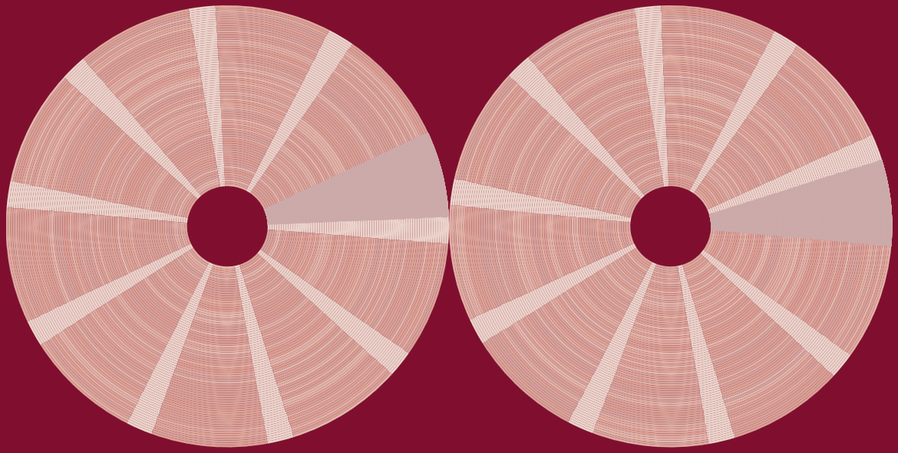

{fig-align="center"}

## Bit Philology events
08.05.2026: Workshop [Digital Forensics in the Humanities](https://dhbern.github.io/content/events/20260508-digital-forensics-workshop/) (University of Bern)

## Conferences
20-22.05.2026: Poster presentation “Les défis du *born-digital* de l'acquisition des corpus à l'édition numérique” at the [Colloque Humanistica 2026](https://humanistica2026.sciencesconf.org/) (EPITA, Paris)  

## Project description

*Bit Philology is a SNSF Starting Grant project running from 2025 to 2030.*

Today, much literature is created digitally. Literary archives, which preserve the manuscripts of writers, increasingly include digital documents (known as ‘born-digital’), which pose challenges for their study. The Bit Philology project will propose innovative solutions for describing, editing and analysing digital literary archives, while meeting the scientific and societal needs of our digital age.

Philology is a discipline that is thousands of years old. Textual scholars have studied and continue to study papyri, manuscripts, epigraphic and printed sources, and have developed methodological tools to work with texts preserved in different forms and on different media. But what happens when a text is born digital? A growing number of born-digital texts are currently being archived, including documents of historical importance and literary material. This project focuses on the latter, the born-digital literary archive, as a source for the philology of the present and the future.

Scholarship on born-digital sources has identified the need for a rethinking of traditional methodologies in order to transform the born-digital source into a scholarly object of study. The Bit Philology project seeks to respond to this need by describing, editing and analysing born-digital literary sources. The aim of the project is to establish a methodological and technical toolkit for the study of born-digital literary sources created before the advent of cloud computing. The project is highly interdisciplinary and will combine approaches from digital humanities (data modelling, distant reading); authorial philology (filologia d'autore) and genetic criticism (critique génétique); the philological tradition concerned with the materiality of textual documents (filologia materiale, material bibliography, digital forensics); media and software studies; information design.

## Project members

PI: [Prof. Dr. Elena Spadini](https://www.dh.unibe.ch/about_us/people/prof_dr_spadini_elena/index_eng.html)  
PhD student: [Elena Barchielli](https://www.dh.unibe.ch/about_us/people/barchielli_elena/index_eng.html)  
PhD student: [Simon Willemin](https://www.dh.unibe.ch/about_us/people/willemin_simon/index_eng.html)  