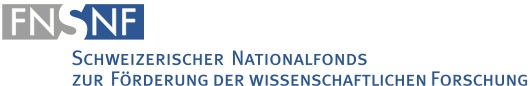
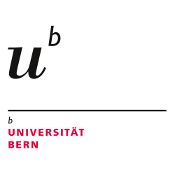
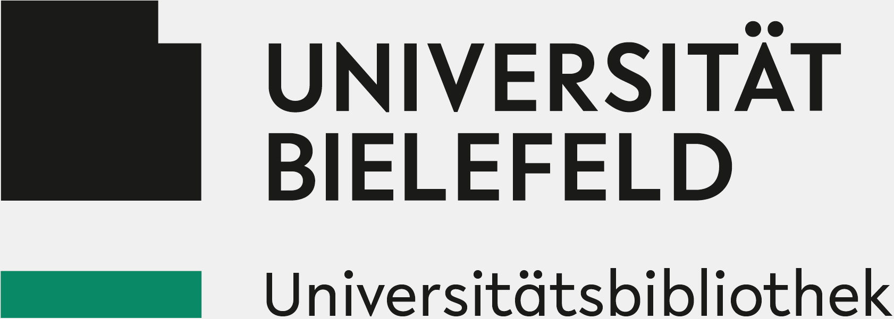
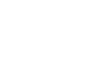

::: {#flow-hero .flow-hero}
::: {.flow-eyebrow}
Conference
:::

## The FLOW Conference

::: {.flow-subtitle}
From Deep Learning to Digital Analysis and their Role in the Humanities
:::

::: {.flow-meta}
- **Dates:** 11–12 June 2026
- **Location:** University of Bern, Mittelstrasse 43, 3012 Bern
:::

::: {.flow-cta-row}
[View program](#conference-program)
[Partners](#partners-and-supporters)
:::
:::

::: {.panel-tabset}
## Home

### Welcome

::: {.quick-info}
- **Dates:** 11–12 June 2026
- **Venue:** University of Bern, Mittelstrasse 43, 3012 Bern
- **Organisers:** Serena Tolino, Tobias Hodel
- **Program:** Schedule below
:::

The Flow project – *From Deep Learning to Digital Analysis and their Role in the Humanities* – is exploring how digital workflows can transform the study of historical sources. Over the past years, the project has brought together historians, linguists, and computer scientists to develop, evaluate, and critique workflows that connect the interpretive traditions of the humanities with the methodological rigor of data science. At its heart, FLOW is about creating, evaluating, and reflecting on the workflows themselves — the sequence of processes that link source material to digital interpretation. Beginning with text recognition, through text annotation, model training, and ultimately publishing, the project has sought to make each step transparent, reusable, and critically informed. By developing models for Handwritten Text Recognition (HTR) and Natural Language Processing (NLP) and publishing them openly on platforms such as Hugging Face, The Flow contributes to the broader digital humanities community and to the principle of reproducible, collaborative research.

The project’s historical case studies form the practical testing ground for these workflows. The four doctoral projects investigate distinct legal and administrative corpora — from medieval England and the Hanseatic cities of Northern Europe, to the early modern records of Bern and the sijill registers of Jerusalem. Together, they demonstrate how digital methods can uncover patterns of institutional practice and social interaction that are otherwise difficult to discern in premodern texts.

This final conference in Bern marks both a conclusion and a beginning. It offers a platform for external experts to discuss the epistemological and methodological implications of digital workflows in the humanities, while giving the Flow doctoral researchers the opportunity to present their findings and reflect on the integration of machine learning in historical research. The different experts will engage in a discussion on the infrastructural, methodological, and data-driven foundations of scholarly work, with particular attention to the role of clearly structured digital workflows in an era of growing AI hype. To ensure targeted and transparent digital text practices, the papers explore key workflow components such as automated handwriting recognition, text recognition and processing, named entity recognition, and language modelling.

Central questions include:
- What kinds of digital workflows exist, and how are they structured?
- At which stages of a research project can specific questions or tasks meaningfully be addressed through digital or automated methods?
- Which strategies support reproducibility and long-term usability of digital research?
- Which resources — both equipment and different expertises — are needed to design and implement digital workflows for a variety of digital tasks in historical research?

By bringing a variety of digital perspectives together, the conference invites us to think about what it means to “work in flow” — to move between documents and algorithms, between human interpretation and machine learning — and how such movement can expand the horizons of historical inquiry. As a result of the conference, a joint publication will be submitted to the peer-reviewed series “Digital Humanities Research” (Bielefeld University Press).

### Partners and supporters

::: {.partner-logos}
|  |  |  |  |
| --- | --- | --- | --- |
|  |  |  |  |
:::

## Conference program

::: {.program-note}
Schedule at a glance (subject to minor updates).
:::

::: {.program-day}
### Thursday, 11 June 2026

| Time  | Session |
| --- | --- |
| 09:00 | Welcome |
| 09:15 | Intro by the organizers: Serena Tolino, Silke Schwandt, Angela Huang, Tobias Hodel |
| 09:45 | Input by Developers: From Preprocessing to Text Recognition; from Language Modeling to Information Extraction — Dana Meyer & Jonas Widmer; Malte Meister (TU Darmstadt) |
| 11:00 | *Coffee break* |
| 11:30 | Text Recognition Pipelines — Michael Schonhardt (TU Darmstadt); Melvin Wilde & Christopher Kuhlman |
| 13:00 | *Lunch break* |
| 14:00 | Named Entities — Maud Ehrmann (EPFL); Dominic; Dana Meyer & Silke Schwandt |
| 16:00 | *Break* |
| 17:00 | Barbara McGillivray (King's College London) |
:::

::: {.program-day}
### Friday, 12 June 2026

| Time  | Session |
| --- | --- |
| 09:15 | Corpus & Text Re-Use — TBD; Sefer Korkmaz & Inga Lange |
| 11:00 | *Coffee break* |
| 11:30 | LLM & Final Discussion — Sarah Oberbirchler |
| 14:00 | *End of conference* |
:::
:::
